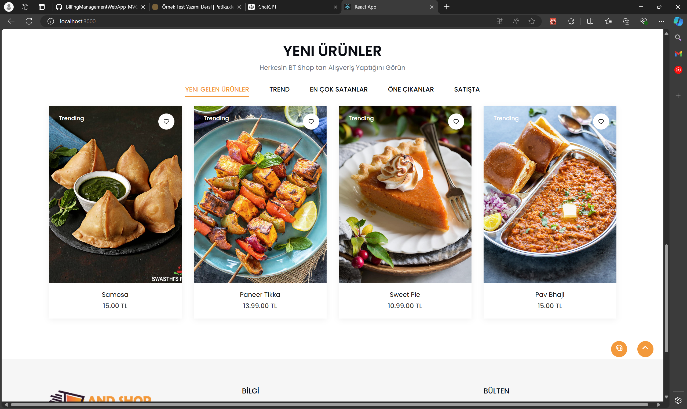
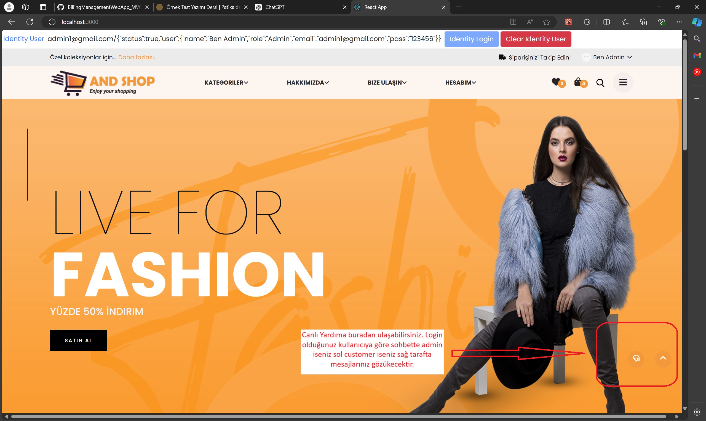
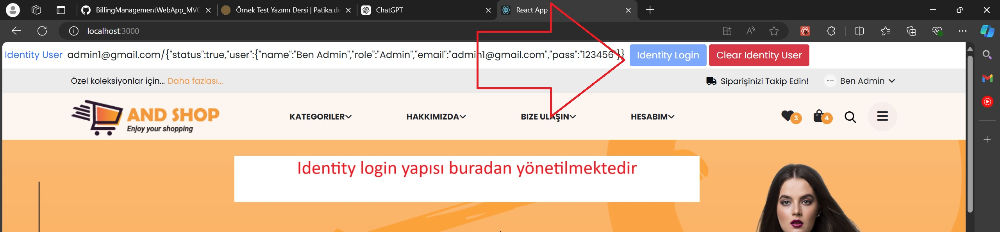
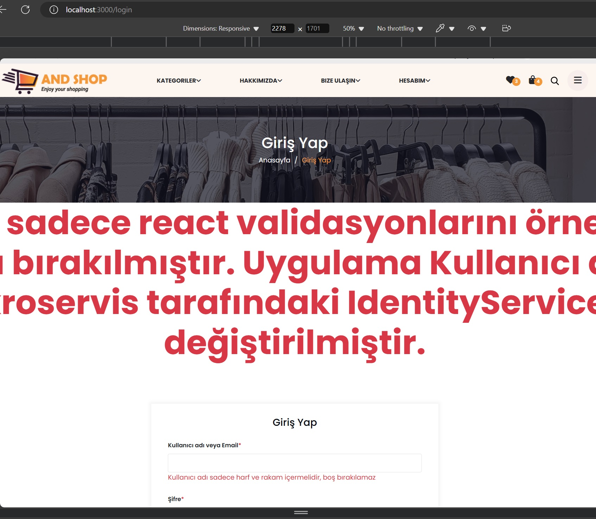
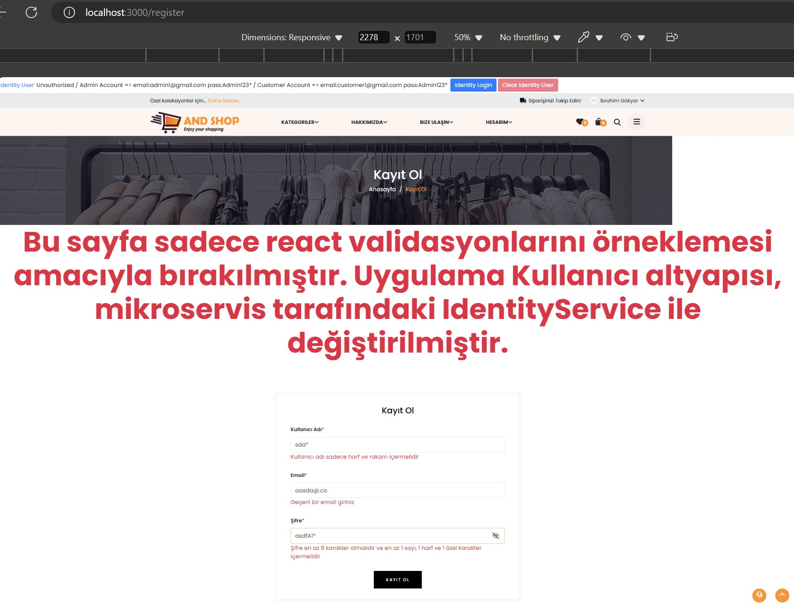

# E-Ticaret Uygulaması

Bu proje, arka uç için mikroservis mimarisi kullanan ve ön uçta React tabanlı bir e-ticaret uygulamasıdır. Aşağıda özellikler, kurulum talimatları ve mimariye dair detaylı bir açıklama bulabilirsiniz.

## İçindekiler

- [Giriş](#giriş)
- [Özellikler](#özellikler)
- [Mimari Genel Bakış](#mimari-genel-bakış)
- [Ön Uç Kurulumu](#ön-uç-kurulumu)
- [Arka Uç Kurulumu](#arka-uç-kurulumu)
- [Test](#test)
- [Ek Bilgiler](#ek-bilgiler)

## Giriş

Bu uygulama, ürün yönetimi ve kullanıcı doğrulama gibi farklı sorumlulukları ele alan çeşitli mikroservisleri barındıran modern bir e-ticaret platformu örneği sunmaktadır. Ön uç React ile, arka uç ise .NET Core ve birkaç mikroservis ile oluşturulmuştur.

## Özellikler

### 1. Ürün Yönetimi

- Ürünler, ürün kataloğunu yönetmekten sorumlu `ProductAPI` mikroservisinden çekilmektedir.
- Ürün kataloğu, ön uç uygulamada zenginleştirilip görüntülenmektedir, böylece uygulama genelinde tutarlı bir yapı korunmaktadır.
  

### 2. Sohbet Servisi

- SignalR kullanılarak gerçek zamanlı bir sohbet servisi oluşturuldu ve arka uçta bir Web API olarak entegre edildi.
- Ön uçta, kullanıcıların sohbet servisine erişebilmesi için bir sohbet butonu yerleştirildi.
  

### 3. Doğrulama ve Yetkilendirme

- Önceki giriş fonksiyonu kaldırıldı ve uygulama genelinde yetkilendirme sağlayan bir Identity mikroservisi kullanıldı.
- Orijinal giriş sistemi iptal edilmiş olmasına rağmen, `localhost:3000/login` ve `localhost:3000/register` adreslerinde bulunan formlar, validasyon yeteneklerini sergilemek amacıyla bırakıldı. Bu formlar, gerekli React validasyon mantığını içermektedir.
  
  
  

### 4. Birim Testleri

- Kritik bileşenlerin güvenilirliğini sağlamak için birim testleri eklendi:
  - **React**: Testler, veri çekme ve giriş işlemlerini kapsamaktadır.
  - **.NET**: Testler, `ProductAPI` mikroservisi içindeki `ProductRepository` üzerinde yoğunlaşmaktadır.

### 5. Fonksiyonel Arama Çubuğu

- Kategoriler/filtreleme bölümünde yer alan arama çubuğu, kullanıcıların arama kriterlerine göre ürünleri filtrelemesini sağlayacak şekilde fonksiyonel hale getirildi.

### 6. Güvenli Müşteri Destek Sohbeti

- Müşteri destek sohbet servisi, yalnızca doğrulanmış kullanıcıların erişebilmesi için `OidcSecure` kullanılarak güvenli hale getirildi.
- Identity mikroservisinden alınan kullanıcı verileri, ön uç uygulamasındaki kullanıcı sistemine sorunsuzca entegre edildi, bu sayede uygulama genelinde global olarak tanınır hale geldi.

## Mimari Genel Bakış

- **Ön Uç**: `ecommerce-app-2` dizininde bulunan React.js uygulaması.
- **Arka Uç**: `ecommerceradoreornek` dizininde bulunan .NET Core mikroservisleri, şunları içermektedir:
  - `ProductAPI`
  - `IdentityAPI`
  - `ChatService` (SignalR)
  - Alışveriş sepeti ve kupon yönetimi için ek mikroservisler.

## Ön Uç Kurulumu

1. **Ön uç dizinine gidin:**
   ```bash
   cd ecommerse-app-2
   ```
2. **Bağımlılıkları yükleyin:**
   ```bash
   npm install
   ```
3. **React uygulamasını çalıştırın:**
   ```bash
   npm start
   ```
4. **Uygulamayı açın: Tarayıcınızda http://localhost:3000 adresini açın.**

## Arka Uç Kurulumu

1. Arka uç dizinine gidin:
   ```bash
   cd ecommerceradoreornek
   ```
2. Mikroservisleri başlatın: Gerekli tüm mikroservislerin çalıştığından emin olun. Bu genellikle Docker üzerinden veya her projeyi Visual Studio veya komut satırı ile ayrı ayrı çalıştırarak yapılabilir.

   Bir mikroservisi çalıştırma örneği:

   ```bash
   dotnet run --project ./src/Services/ProductAPI/ProductAPI.csproj
   ```

3. Servislerin çalıştığını doğrulayın: Konfigürasyonda tanımlanan ilgili URL'ler üzerinden servislerin erişilebilir olduğunu doğrulayın.

## Test

### Ön Uç

React birim testlerini çalıştırmak için:

```bash
npm test
```

### Arka Uç

.NET birim testlerini çalıştırmak için:

```bash
dotnet test
```

Bu testler şunları kapsar:

- React uygulamasında veri çekme ve giriş işlemleri.
- ProductAPI mikroservisinde ürün CRUD işlemleri.

## Ek Bilgiler

- Görseller: Uygulamada gösterim amaçlı kullanılan fotoğraflar, kök dizinde (./) bulunan 1.jpg ve 2.jpg dosya adlarına sahiptir.
- Global Entegrasyon: Identity mikroservisinden gelen kullanıcı verileri, ön uç kullanıcı sistemine tam entegre edilmiştir, bu sayede veri uygulama genelinde global olarak tanınır hale gelir.
- Ürün Kataloğu: ProductAPI mikroservisinden çekilen ürünler mevcut ürün kataloğuna eklenmiştir, bu da uygulamanın ürün yapısını koruyarak zenginleştirmiştir.
